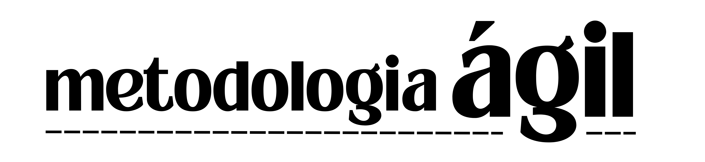

  

  

### História
A metodologia ágil teve origem no final da década de 1990, como uma alternativa aos métodos tradicionais de gerenciamento de projetos. Durante esse período, muitas empresas estavam insatisfeitas com os resultados obtidos por meio dos métodos cascata, nos quais todas as fases do projeto eram definidas antecipadamente e seguidas de forma linear.

### O que é?

- Conjunto de estratégias e práticas para o desenvolvimento e gestão de projetos, que busca dar maior velocidade à conclusão de processos e tarefas.
- As metodologias ágeis foram desenvolvidas a partir do **Manifesto Ágil** e trouxeram uma nova lógica para a produção na área.
- Tem o objetivo de otimizar o fluxo de trabalho, aumentando a produtividade de equipes, sem abrir mão da entrega de qualidade em projetos.

### Manifesto Ágil
O Manifesto Ágil é uma declaração de valores e princípios essenciais para o desenvolvimento de software. São 4 valores e 12 Princípios.

**_Valores_**

1. **_Indivíduos e interações mais que processos e ferramentas:_** destaca a importância das pessoas e de suas interações na produção de software de qualidade. 

2. **_Software em funcionamento mais que documentação abrangente:_** destaca a importância de ter um software funcional e em execução como medida de pr
ogresso. Embora a documentação seja necessária, o principal foco deve ser em desenvolver software que atenda às necessidades do cliente.

3. **_Colaboração com o cliente mais que negociação de contratos:_** destaca a importância da colaboração próxima com o cliente ao longo do processo de desenvolvimento. 

4. **_Responder a mudanças mais que seguir um plano:_** destaca que os requisitos e as circunstâncias do projeto podem mudar ao longo do tempo. As equipes ágeis devem estar preparadas para responder rapidamente a essas mudanças, ajustando seus planos e prioridades conforme necessário.

**_Princípios_**

  

  

|**Normal**|**Ágil**|
|-|:-:|
|Previsibilidade de resultados|Mudanças constantes a partir das revisões|
|Projeto com escopo linear|Escopo baseado em ciclos de utilização|
|Cronograma detalhado|Cronograma em blocos de tempo|
|Orçamento definido|Orçamento distribuído conforme os resultados|

### Onde usar?

**_Projetos com novas funcionalidades_**
Para acrescentar ou modificar funções de um produto tradicional pode-se usar as metodologias ágeis para gerenciar o projeto, como um teste para que a empresa se familiar com os novos procedimentos.

**_Aplicativos_**
Lojas, bancos, faculdades e até agências governamentais podem usar a Metodologia Ágil na empresa, uma vez que são áreas em constante atualizações.

**_Comunicação_**
As tecnologias de comunicação são profundamente impactadas pelas metodologias ágeis. Um plano de marketing baseado em ciclos de atualização permite avaliar como a mensagem da empresa está sendo recebida pelo público e testar linguagens, formatos ou plataformas.

### Vantagens e Desvantagens:

**_Vantagens_**

- Quais são as vantagens dos métodos ágeis?
- As entregas são mais rápidas
- Métodos ágeis deixam o software mais flexível
- A boa qualidade do software

**_Desvantagens_**

- Uma das únicas desvantagens do método ágil é que a equipe deve ser muito especialista no método, o que pode ser difícil de conseguir.

## Conclusão
No contexto atual, as práticas de gestão de projetos tradicionais precisam se adequar às novas exigências do mercado, que cobra a entrega de valor ao cliente de forma otimizada, transparente, mais "rápida", com entregas menores e com frequência, e colaborativa. A metodologia Ágil é uma excelente solução para eliminar gaps nos projetos e potencializar as entregas, de modo que gere mais valor ao cliente e à organização executora. Conclusão: maior satisfação do cliente.

### INTEGRANTES
1. Heloísa Bordini Mendonça
2. Maria Clara Pavan Caleffi
3. Milena Felisbelo da Silva
4. Miriam Bordini Mendonça